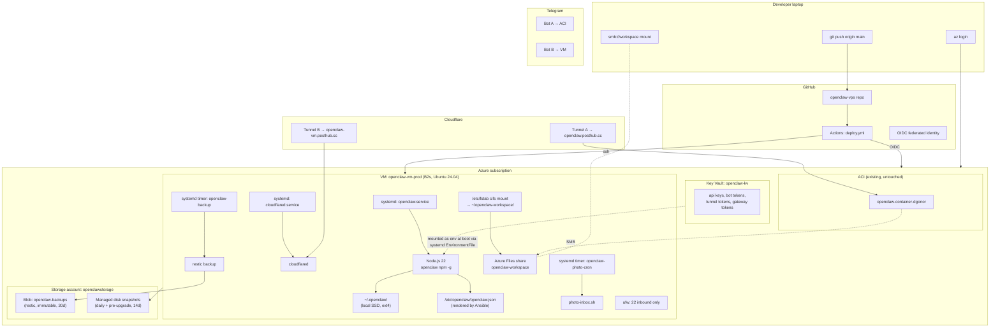

# Design: OpenClaw on Dedicated Azure VPS (`openclaw-vps`)

> Status: **draft**
> Companion docs: [`rfc.md`](./rfc.md) · [`implementation.md`](./implementation.md) · [`tasks.md`](./tasks.md)
> Target repo: `github.com/honoyr/openclaw-vps` (new, sibling to `openclaw-deploy`)
> Upstream OpenClaw VPS guide: <https://docs.openclaw.ai/vps>

This document describes **what** we're building. The "why" is in [`rfc.md`](./rfc.md). The "how, step by step" is in [`implementation.md`](./implementation.md).

---

## 1. Overview

A new GitHub repo, `openclaw-vps`, deploys OpenClaw to a long-lived Azure VM via:

- **Bicep** for the Azure resources (VM, disk, NSG, snapshot policy, Key Vault access).
- **Ansible** for in-VM configuration (Node 22, openclaw npm-global, systemd units, ufw, fstab, cloudflared, restic).
- **GitHub Actions + OIDC** for CI/CD: lint → bicep what-if → ansible dry-run → apply on `main`.
- **Cloudflare Tunnel** for HTTPS at a **new** hostname (`openclaw-vm.posthub.cc`) — the existing ACI tunnel/hostname is untouched.

The VM coexists permanently with the ACI deployment per [§10 of the RFC](./rfc.md#10-dual-environment-topology-added-2026-05-08). They share API keys and `~/openclaw-workspace/` (media); they do **not** share `~/.openclaw/` runtime state.

---

## 2. Architecture diagram



---

## 3. Component design

### 3.1 Azure resources (Bicep)

A single `main.bicep` parameterised by environment composes these modules:

| Module | Responsibility |
|---|---|
| `vm.bicep` | Linux VM (`Standard_B2s`), OS disk (Premium SSD 30 GB), data disk for state if we outgrow OS disk, public IP (Standard SKU), nic, ssh key (sourced from KV). |
| `networking.bicep` | NSG: inbound 22 only from a configurable IP allowlist. No public 80/443/18789. (Cloudflared makes outbound-only connections.) |
| `snapshot-policy.bicep` | Azure Backup or recovery-services vault policy: nightly + 7-day retention; manual pre-upgrade snapshots via `scripts/snapshot.sh`. |
| `key-vault-access.bicep` | Grant the VM's system-assigned managed identity `get`/`list` on secrets in the existing `openclaw-kv`. |
| `storage.bicep` | **Reference-only** to the existing storage account; no creation. Outputs the Files-share endpoint and the backup-blob container name for the Ansible vars. |

**Why Bicep over Terraform:** matches `openclaw-deploy` Topic 8b plan (per RFC §9 Q4).

### 3.2 In-VM configuration (Ansible)

Ansible roles (one per concern, idempotent):

| Role | What it does |
|---|---|
| `base` | apt update/upgrade; install `curl`, `jq`, `restic`, `ufw`, `fail2ban`, `unattended-upgrades`. Configure ufw to deny incoming except 22. Configure fail2ban for sshd. Add 2 GB swap file. |
| `openclaw_user` | Create system user `openclaw` (no shell login from network; sudo only via `wheel`). Create `~/.openclaw/`, `~/openclaw-workspace/` mountpoint, `/etc/openclaw/`. |
| `nodejs` | Add NodeSource APT repo for Node 22 LTS. Install `nodejs` package. Pin `npm` to a known version. |
| `openclaw` | `npm i -g @openclaw/openclaw@{{ openclaw_version }}` plus a configurable list of plugin packages (`openclaw_plugins`). Render `/etc/openclaw/openclaw.json` from `templates/openclaw.json.j2`. Install `openclaw.service` systemd unit. Install `EnvironmentFile=/etc/openclaw/env` populated from Key Vault at boot via a oneshot `openclaw-fetch-secrets.service`. |
| `cloudflared` | Install via official APT repo. Install `cloudflared.service` systemd unit; tunnel token sourced from KV. |
| `azure_files_mount` | `/etc/fstab` cifs entry for `~/openclaw-workspace/` only (NOT for `~/.openclaw/`). Credentials via `/etc/openclaw/smb-credentials` (mode 0600, owned by openclaw). |
| `cron_photo_inbox` | Install `openclaw-photo-cron.timer` + `.service`. **Conditionally enabled** via `photo_cron_enabled: true` group_var (always true on VM, false elsewhere). |
| `backup` | Install restic. Initialise repo at `azure:openclaw-backups:/vm-prod/`. Install `openclaw-backup.timer` (nightly 03:00 UTC) running `restic backup ~/.openclaw/ /etc/openclaw/`. |
| `health` | Install a `/usr/local/bin/openclaw-healthcheck` script and a systemd timer that hits `http://127.0.0.1:18789/api/v1/health` every 5 min, restarting the unit on 3 consecutive failures. |

### 3.3 systemd units

```
openclaw-fetch-secrets.service   (oneshot, before openclaw.service)
  ↓ writes /etc/openclaw/env from KV via az-cli
openclaw.service                 (Type=simple, Restart=on-failure, User=openclaw)
  ↓ ExecStart=/usr/bin/openclaw start --config /etc/openclaw/openclaw.json
cloudflared.service              (independent; restarts independently)
openclaw-photo-cron.timer        (every 10 min) → openclaw-photo-cron.service
openclaw-backup.timer            (daily 03:00) → openclaw-backup.service
openclaw-healthcheck.timer       (every 5 min) → openclaw-healthcheck.service
```

**Why systemd:** matches OpenClaw's official VPS guide; survives reboots; `journalctl -u openclaw` for logs; `systemctl restart` is the supported upgrade primitive.

### 3.4 Config rendering (`openclaw.json.j2`)

Single Jinja2 template. Inputs come from group_vars + per-host vars:

- `openclaw_env: vm` (or `aci` if reused later)
- `gateway_token: "{{ vault_gateway_token }}"`
- `telegram_bot_token: "{{ vault_telegram_bot_token }}"`
- `cloudflare_tunnel_id: "{{ vault_cf_tunnel_id }}"`
- `azure_openai_api_key: "{{ vault_azure_openai_api_key }}"`
- … etc.

Renders to `/etc/openclaw/openclaw.json` mode 0640 owned by `openclaw:openclaw`.

The template is the **same one** that `openclaw-deploy` uses (we copy and de-base64-ise — see [implementation.md §3](./implementation.md)). This keeps both envs in sync schema-wise.

### 3.5 Secrets handling

Three layers:

1. **Source of truth: Azure Key Vault** (`openclaw-kv`, already exists per `openclaw-deploy` Topic 8b). New secrets added: `gateway-token-vm`, `telegram-bot-token-vm`, `cf-tunnel-token-vm`.
2. **Local dev: `scripts/env.sh`** (gitignored) for ad-hoc `ansible-playbook` runs from the laptop. Mirrors `openclaw-deploy` convention.
3. **In-VM: `/etc/openclaw/env`** (mode 0600, owned by openclaw) populated at boot by `openclaw-fetch-secrets.service` via `az keyvault secret show` using the VM's managed identity.

`ansible-vault` is used **only** for secrets that must travel with the playbook (e.g. KV name itself, restic repo password). All app secrets stay in KV.

### 3.6 Backup / recovery (3 layers, defence in depth)

| Layer | Tool | Frequency | Retention | Recovers what |
|---|---|---|---|---|
| 1. Config-as-code | git | continuous | forever | playbooks, templates, scripts |
| 2. State backup | restic → Azure Blob (`openclaw-backups` container, immutable lock) | nightly 03:00 UTC + manual pre-upgrade | 30 days | `~/.openclaw/`, `/etc/openclaw/` |
| 3. VM snapshot | Azure Backup vault | nightly + manual pre-upgrade | 14 days | full OS disk |

Recovery scripts:

- `scripts/rollback.sh` → restore latest restic snapshot (state only, fastest)
- `scripts/snapshot.sh` → take pre-upgrade VM snapshot
- `scripts/restore-vm.sh` → full VM restore from Azure Backup

### 3.7 Upgrade procedure

Documented in `docs/upgrade-procedure.md`. Summary:

```
1. scripts/snapshot.sh                      # backstop
2. edit ansible/group_vars/all.yml          # bump openclaw_version
3. ansible-playbook ansible/site.yml --tags openclaw   # apply
4. systemctl status openclaw                # verify
5. scripts/smoke-prod.sh                    # functional probe
6. (rollback if needed: scripts/rollback.sh)
```

A bad upgrade rolls back in **<30 seconds** via `npm i -g @openclaw/openclaw@<prev>` triggered by `scripts/rollback.sh --version <prev>`.

### 3.8 Dual-environment coordination

Per [RFC §10](./rfc.md#10-dual-environment-topology-added-2026-05-08):

- **Photo-inbox cron:** group_var `photo_cron_enabled: true` on VM, must be set to `false` in `openclaw-deploy` (separate change in that repo, tracked as a one-line PR).
- **Logging tag:** every `openclaw.service` log line is prefixed `[VM]` via `SyslogIdentifier=openclaw-vm` in the unit file. Telegram bot B's reply prefix configured via plugin config.
- **iOS Shortcuts:** `scripts/gen-ios-shortcuts.py` (port from `openclaw-deploy`) takes `--env vm` flag and outputs `OpenClaw-VM-*.shortcut` files targeting tunnel B + bot B.
- **Version drift:** `openclaw_version` on VM bumps first; ACI's `OPENCLAW_VERSION` follows after ≥3 days of green VM smoke runs. (Operational rule, not enforced in code.)

---

## 4. Repo layout (final)

```
openclaw-vps/
├── README.md
├── .gitignore
├── .github/workflows/
│   ├── lint.yml                  # ansible-lint + bicep build + shellcheck
│   ├── deploy.yml                # OIDC → bicep what-if → ansible-playbook
│   └── nightly-snapshot.yml      # cron → az snapshot create
├── bicep/
│   ├── main.bicep
│   ├── parameters.prod.json
│   └── modules/
│       ├── vm.bicep
│       ├── networking.bicep
│       ├── snapshot-policy.bicep
│       ├── key-vault-access.bicep
│       └── storage.bicep
├── ansible/
│   ├── ansible.cfg
│   ├── site.yml
│   ├── inventory.ini
│   ├── group_vars/
│   │   └── all.yml
│   ├── host_vars/
│   │   └── prod.openclaw.vault.yml   # ansible-vault encrypted
│   ├── roles/
│   │   ├── base/
│   │   ├── openclaw_user/
│   │   ├── nodejs/
│   │   ├── openclaw/
│   │   │   ├── tasks/main.yml
│   │   │   ├── templates/openclaw.json.j2
│   │   │   ├── templates/openclaw.service.j2
│   │   │   └── files/openclaw-fetch-secrets.sh
│   │   ├── cloudflared/
│   │   ├── azure_files_mount/
│   │   ├── cron_photo_inbox/
│   │   ├── backup/
│   │   └── health/
│   └── vault-password-file        # path only; actual file gitignored
├── config/
│   └── openclaw.json.j2           # symlink-target / canonical copy
├── scripts/
│   ├── env.sh.example
│   ├── provision.sh               # az deployment + ansible-playbook
│   ├── upgrade.sh
│   ├── snapshot.sh
│   ├── rollback.sh
│   ├── restore-vm.sh
│   ├── smoke-prod.sh              # ported from openclaw-deploy
│   ├── gen-ios-shortcuts.py       # ported, --env vm flag added
│   └── lib/                       # shared bash helpers
├── docs/
│   ├── runbook.md
│   ├── migration-from-aci.md
│   ├── disaster-recovery.md
│   ├── upgrade-procedure.md
│   └── dual-environment-ops.md
└── test/
    ├── test-ansible-syntax.sh
    ├── test-bicep-build.sh
    ├── test-systemd-units.sh
    ├── test-smoke-stub.sh
    └── helpers.sh
```

---

## 5. Cross-cutting concerns

### 5.1 Security

- **NSG** allows only port 22, only from a configurable IP allowlist (your home + GitHub Actions outbound ranges if needed).
- **OpenClaw gateway** binds to `127.0.0.1:18789` (loopback only); reachable externally only via Cloudflare Tunnel.
- **Gateway token** mandatory; rotated by re-running ansible after updating the KV secret.
- **ssh** key-only, root login disabled, fail2ban active.
- **Managed identity** for KV access — no service-principal secrets on disk.
- **restic repo** encrypted with a password stored in KV.
- **Workspace SMB share** mounted with `noexec,nosuid` to reduce blast radius.

### 5.2 Observability

- `journalctl -u openclaw -f` is the primary log stream.
- `openclaw-healthcheck.service` writes results to journal with structured fields (`status=ok|fail`, `latency_ms=…`).
- Optional (deferred): forward journal to Azure Log Analytics via `azuremonitorlinuxagent`. **Not in v1.**

### 5.3 Testing

Three tiers (mirrors `openclaw-deploy`):

| Tier | What | When |
|---|---|---|
| 1 (local) | `ansible-lint`, `bicep build`, `shellcheck` | every PR via Actions |
| 2 (staging) | `ansible-playbook --check --diff` against prod inventory | every PR; comment on diff |
| 3 (prod) | `scripts/smoke-prod.sh` | post-deploy in `deploy.yml` |

`smoke-prod.sh` is copied verbatim from `openclaw-deploy` so the two envs use identical functional probes.

### 5.4 Idempotency contracts

- `ansible-playbook ansible/site.yml` must be safe to re-run any number of times with no functional change if no inputs changed.
- `scripts/upgrade.sh` must detect "already on target version" and exit 0 cleanly.
- `scripts/provision.sh` is the only script allowed to be non-idempotent (it creates the VM); all others are re-runnable.

### 5.5 Failure modes considered

| Failure | Detection | Recovery |
|---|---|---|
| Bad config push | smoke-prod fails in CI | `git revert` + redeploy |
| Bad plugin install | health-check fails 3× → unit restart loops | `npm uninstall -g <plugin>` via emergency ssh, or rollback via restic |
| Bad openclaw version | smoke-prod fails | `scripts/rollback.sh --version <prev>` (npm pin) |
| OS-level corruption | ssh fails or VM unresponsive | `scripts/restore-vm.sh` from snapshot |
| Storage account outage | SMB mount drops; openclaw still serves but media unavailable | Wait it out; `~/.openclaw/` on local disk so chats keep working |
| Region outage | VM unreachable | Bring VM up in alt region from snapshot (manual; not automated in v1) |

---

## 6. Out-of-scope (deferred / parking lot)

- Multi-region failover.
- Per-plugin sandboxing (nsjail/firejail).
- Replacing Cloudflare Tunnel with Caddy/Traefik + Let's Encrypt.
- Migrating the SMB share to NFS Premium (tracked in `openclaw-platform-roadmap/` Topic 0).
- Shared remote memory backend across VM + ACI (RFC §10 D2).
- One-way `paired.json` sync VM → ACI (RFC §10 D1).
- Topic 10 ACP-harness rollout — separate roadmap entry; will trigger Option 1 → Option 3 transition (Docker compose for sidecars).

---

## 7. Acceptance criteria

This design is complete (and Topic 8a-VPS is "done") when:

1. ✅ `git clone openclaw-vps && scripts/provision.sh` produces a working VM end-to-end on a clean Azure subscription.
2. ✅ `ansible-playbook ansible/site.yml` is fully idempotent: second run reports zero changed tasks.
3. ✅ Bumping `openclaw_version` in `group_vars/all.yml`, `git push`, and waiting for Actions completes a version upgrade with **no image rebuild** and **no manual intervention**.
4. ✅ Installing a plugin: edit `openclaw_plugins:` list in `group_vars/all.yml`, push, deploy → plugin available in OpenClaw within 5 minutes.
5. ✅ A bad version pushed to `main` triggers smoke-prod failure and is auto-rolled-back by `deploy.yml` to the previous `openclaw_version`.
6. ✅ A nightly snapshot completes and is restorable end-to-end (verified by test restore to a sandbox VM at least once).
7. ✅ Both ACI and VM serve their respective domains, talk to their own bot, and don't interfere with each other for 7 consecutive days under normal load.
8. ✅ `docs/runbook.md` covers every operational task without referring back to source code.
