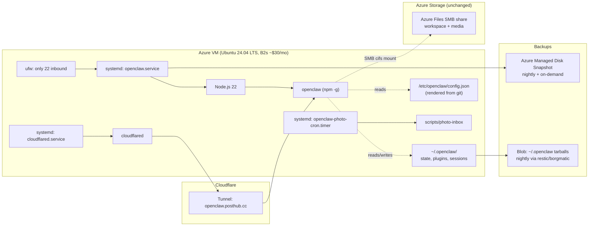
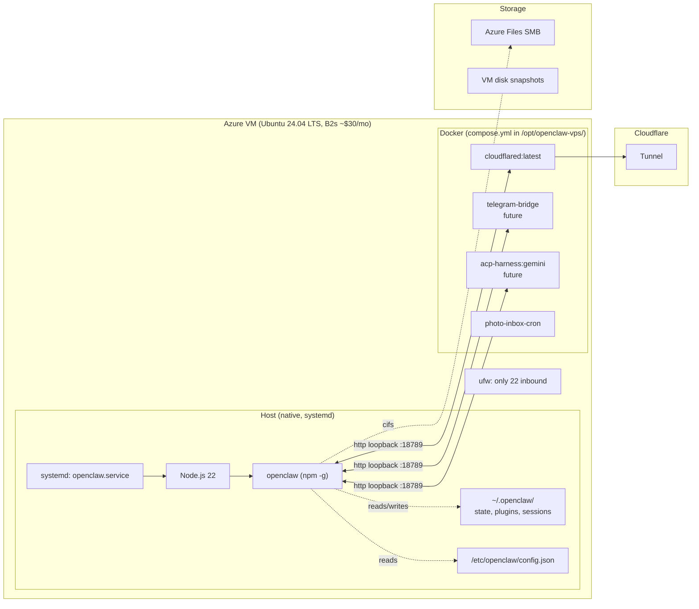
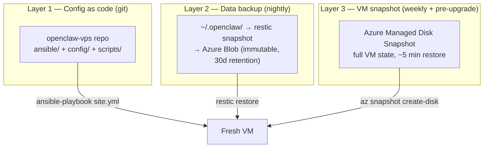
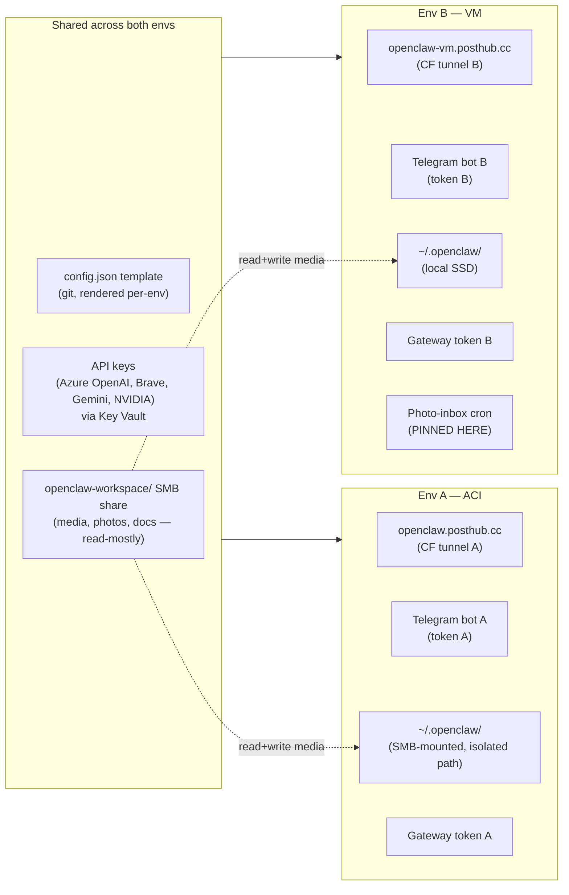

# RFC: Migrate OpenClaw from Azure Container Instances to a Dedicated VPS

> Status: **draft / for review**
> Owner: @honoyr
> Companion repo (today): [`openclaw-deploy`](https://github.com/honoyr/openclaw-deploy)
> Companion repo (planned): `openclaw-vps` (new, separate from `openclaw-deploy`)
> Related: [`docs/wip/openclaw-platform-roadmap/`](../openclaw-platform-roadmap/)

---

## 1. Problem statement

Today's deployment runs as a single ACI (Azure Container Instances) container built from a thin wrapper Dockerfile on top of `ghcr.io/openclaw/openclaw:<tag>` (see [`openclaw-deploy/docker/Dockerfile`](https://github.com/honoyr/openclaw-deploy/blob/main/docker/Dockerfile)). The container mounts an Azure Files SMB share at `/home/node/.openclaw/_state/` for paired devices, sessions, plugins-state, etc. Container-level mutations that **don't** live under that mount are wiped on every redeploy.

Pain points the user has hit repeatedly:

1. **Plugin installs don't persist.** Installing a plugin via `npm i -g @openclaw/<plugin>` inside the running container disappears on the next `az container create`. Workaround today: bake plugins into the wrapper image (e.g. `brave-plugin`, `memory-lancedb-plugin` after the 5.3 slim regression — see *openclaw-deploy/docs/discoveries/2026-05-05-openclaw-5.4-slim-missing-plugins.md*). This forces an ACR rebuild for every plugin tweak.
2. **Version upgrades are all-or-nothing.** Bumping `OPENCLAW_VERSION` in env.sh + rebuilding image is the only path. There's no in-place `npm update -g` workflow with rollback.
3. **Regressions surface late.** Each rebuild can ship subtle ecosystem changes (slim variant dropping plugins, scope-default shifts, config-schema breakage). The container's immutable nature means you only learn about regressions *after* deploy. Recovery = rebuild a previous tag.
4. **Stateful test/iterate loop is slow.** Every config or plugin tweak = ACR build + container delete + container create + gateway-ready wait (~3–5 min round trip).

**Root cause:** ACI is optimised for stateless workloads. OpenClaw — with its plugin marketplace, evolving config, and per-device pairings — is fundamentally a **stateful, mutable** runtime. The impedance mismatch shows up as the four pain points above.

## 2. Goals & non-goals

### Goals

- **G1.** Plugin installs and `openclaw` version upgrades persist across reboots **without an image rebuild**.
- **G2.** Reproducible setup from a fresh VM (config-as-code remains the source of truth — no "snowflake server").
- **G3.** Snapshot-based recovery: roll back the *whole* runtime (binary + plugins + state) to a known-good point in seconds.
- **G4.** Cheap iteration: `ssh && edit config && systemctl restart openclaw` works for fast loops.
- **G5.** Cloud-portable: Azure VM today, but the design must work on Hetzner/DO/GCP with minimal changes (you mentioned this as a hedge).
- **G6.** Same external surface: Cloudflare tunnel → `https://openclaw.posthub.cc/`, same gateway port, same Telegram bot, same iOS Shortcuts.

### Non-goals

- **NG1.** Multi-node HA. Single VM is fine.
- **NG2.** Re-implementing OpenClaw's auth/scope model. Stays as today.
- **NG3.** Migrating the Azure Files SMB share away. Mac-from-Finder access stays — see Topic 0 in the platform roadmap.
- **NG4.** Replacing ACR / `openclaw-deploy` immediately. Both repos can coexist during transition.

---

## 3. What OpenClaw's official docs say about VPS

Summary of [docs.openclaw.ai/vps](https://docs.openclaw.ai/vps) and the official install guide (cross-referenced against community deploy guides, e.g. ColossusCloud, DeployHQ, Macaron):

| Topic | Official guidance |
|---|---|
| Install method | **Native preferred** for self-hosters: `curl https://openclaw.ai/install.sh \| bash` or `npm i -g @openclaw/openclaw`. Docker shown as alternative. |
| OS | Ubuntu 22.04+ LTS. |
| Sizing | **Min 2 vCPU / 4 GB RAM / 20–40 GB SSD** for daily use; more for heavy browser/agent loads. |
| User isolation | Dedicated non-root user (typically `openclaw` or `node`). |
| Networking | **Bind gateway to loopback** by default; expose via reverse proxy (Nginx/Caddy/Traefik) **or** Cloudflare Tunnel. Never expose `:18789` to the public internet. |
| Auth | `gateway.auth.token` mandatory if reachable beyond loopback. |
| TLS | Let's Encrypt via reverse proxy, **or** Cloudflare Tunnel (which is what we already use). |
| Process supervision | systemd unit (template provided in install.sh). |
| State | `~/.openclaw/` on local disk; back up regularly. |
| Upgrades | `npm update -g @openclaw/openclaw && systemctl restart openclaw`. Rollback by pinning version: `npm i -g @openclaw/openclaw@<old>`. |
| Recommended providers (from docs page) | Hetzner, DigitalOcean, Vultr, Contabo, Oracle Cloud free tier. **Azure VM is supported but not first-class** in the docs — they treat it like any Ubuntu host. |

**Notable mismatch with our current ACI flow:** the official path treats OpenClaw as a long-lived, mutable Node.js app — exactly the model that solves your pain points.

---

## 4. Architectural options

### Option 1 — Native install on the VM (Recommended)



**Properties:**
- Single `apt`/`npm` host. `~/.openclaw/` is just a directory on the VM disk.
- `npm i -g @openclaw/<plugin>` survives reboots — you never need an image rebuild for plugins.
- Upgrades: `npm i -g @openclaw/openclaw@<ver> && systemctl restart openclaw`. Rollback = pin previous version.
- Config still committed to git; rendered onto VM by Ansible/cloud-init. **No snowflake.**
- Snapshot-as-rollback for the whole runtime (OS + Node + npm globals + state) via Azure Managed Disk snapshots.

**Pros:**
- ✅ Solves G1–G4 directly.
- ✅ Smallest delta from OpenClaw's official VPS docs — easy to follow upstream guidance.
- ✅ Cheapest iteration loop: `ssh && edit && systemctl restart` (~3 sec).
- ✅ Provider-portable: same systemd units work on Hetzner / DO / GCP.
- ✅ Plugin/version drift naturally tested on real host before you commit changes.

**Cons:**
- ❌ No process isolation between OpenClaw and host (any rogue plugin runs as `openclaw` user). Mitigated by dedicated user + ufw.
- ❌ Snapshot restores include OS-level cruft (apt updates, log rotation). Treat snapshots as backstop, not primary recovery.
- ❌ Side-services (cloudflared, photo-cron, future ACP harnesses) all live on the same host — coupling.

---

### Option 3 — Hybrid: native OpenClaw + Docker sidecars



**Properties:**
- OpenClaw itself runs natively (same as Option 1 — same plugin/upgrade benefits).
- Everything **around** OpenClaw runs in Docker compose: cloudflared, future ACP harnesses (Gemini-for-YouTube, Claude Code, Copilot CLI per Topic 10), telegram bridge, photo-inbox cron.
- All sidecars talk to OpenClaw over `http://127.0.0.1:18789` (loopback).
- `compose.yml` lives in the new repo and is the source of truth for sidecar versions.

**Pros:**
- ✅ Same G1–G4 wins as Option 1 for OpenClaw itself.
- ✅ **ACP harnesses and integration helpers are isolated** — a misbehaving Gemini-CLI fork can't trash the OpenClaw runtime. This matters for Topic 10 in your roadmap which plans to install **multiple** ACP CLIs (Gemini, Claude Code, Copilot CLI), each with its own auth & quirks.
- ✅ Sidecar upgrades are independent: bump `cloudflared:2026.5` without touching openclaw.
- ✅ Cleaner repo structure: `compose.yml` + per-service `Dockerfile` is more readable than ad-hoc systemd units for 5+ services.
- ✅ Cloudflared's official Docker image is well-maintained — no need for an apt repo on host.

**Cons:**
- ❌ More moving parts. Two supervision systems (systemd for OpenClaw, Docker for sidecars). Two log streams.
- ❌ **Docker daemon itself becomes a host-level dependency** — its own upgrades, networking quirks, root-equivalent group.
- ❌ Loopback boundary between OpenClaw and sidecars means token auth is mandatory even for "internal" calls (which is good security but more setup).
- ❌ Snapshot restore must remember to restore both `/var/lib/docker/volumes/` *and* `~/.openclaw/`. More surface area for partial-restore bugs.
- ❌ Marginal benefit *today* — your only sidecar is cloudflared, which has a perfectly good `.deb` and systemd unit. Hybrid pays off when Topic 10 (ACP harnesses) lands.

---

### Option 2 — Pure Docker on VM (rejected)

Listed for completeness. `docker compose up -d` on the VM with bind-mounted `~/.openclaw/` to host. Solves persistence of *state* but **not plugins** — `npm i -g` inside the container still vanishes on `docker compose pull && up -d`. Same root pain. Rejected.

---

## 5. Recommendation

**Adopt Option 1 today. Migrate to Option 3 when Topic 10 (ACP harnesses) lands.**

Rationale:
1. Option 1 fully solves your stated pain points (G1–G4) with the simplest possible architecture.
2. Option 3's *isolation* benefit is real but only matters once you have ≥3 sidecars. Today you have 1 (cloudflared). Premature.
3. The migration cost from Option 1 → Option 3 later is *low* because:
   - OpenClaw stays native in both. No re-migration of `~/.openclaw/`.
   - You're just moving cloudflared into compose and adding new sidecars there.
   - Already-written systemd unit for OpenClaw remains the supervision mechanism.
4. In the meantime, the new repo can include a placeholder `compose.yml` with cloudflared commented in, so the path forward is documented.

**Decision rule for switching:** when you add the **second** sidecar (e.g. when Topic 10 starts and you install Gemini-CLI alongside cloudflared), promote cloudflared into compose at the same time and you're on Option 3.

---

## 6. Persistence & disaster-recovery model

Three layers, defence in depth:



| Scenario | Recovery method | RTO |
|---|---|---|
| Bad config push | `git revert && ansible-playbook site.yml` | 2 min |
| Plugin/version regression | `npm i -g @openclaw/openclaw@<prev> && systemctl restart` | 30 sec |
| Whole-VM corruption | Restore from latest snapshot | 5–10 min |
| Region outage / migrate to GCP | Provision new VM via ansible + restore `~/.openclaw/` from restic | 30 min |

**Key principle:** *git is the source of truth for configuration; restic is the source of truth for state; snapshots are the backstop.* No drift, no snowflake.

---

## 7. Proposed `openclaw-vps` repo layout

```
openclaw-vps/
├── README.md
├── ansible/
│   ├── site.yml                  # full playbook (idempotent)
│   ├── inventory.ini             # production VM hostname/IP
│   ├── group_vars/
│   │   └── all.yml               # non-secret vars (OPENCLAW_VERSION, etc)
│   ├── host_vars/
│   │   └── prod.openclaw.vault.yml  # ansible-vault for secrets
│   └── roles/
│       ├── base/                 # apt, ufw, swap, unattended-upgrades, fail2ban
│       ├── openclaw_user/        # dedicated `openclaw` user, ssh keys
│       ├── nodejs/               # NodeSource repo + Node 22 LTS
│       ├── openclaw/             # npm -g openclaw + systemd unit + config render
│       ├── cloudflared/          # apt install + systemd unit + token from vault
│       ├── azure_files_mount/    # /etc/fstab cifs mount for SMB share
│       └── backup/               # restic + borgmatic timer
├── config/
│   └── openclaw.json.j2          # jinja2 template, identical schema to today's config/config.json
├── scripts/
│   ├── env.sh.example            # local-only, mirrors openclaw-deploy convention
│   ├── provision.sh              # `terraform apply && ansible-playbook site.yml`
│   ├── upgrade.sh                # bump version in group_vars + redeploy
│   ├── snapshot.sh               # az snapshot create wrapper
│   ├── rollback.sh               # restore latest snapshot
│   ├── smoke-prod.sh             # copied from openclaw-deploy
│   └── lib/                      # shared bash helpers (copied from openclaw-deploy)
├── bicep/                        # VM + disk + NSG + snapshot policy + KV access
│   ├── main.bicep
│   ├── modules/
│   │   ├── vm.bicep
│   │   ├── networking.bicep
│   │   └── snapshot-policy.bicep
│   └── parameters.prod.json
├── docker/                       # placeholder for Option 3 transition
│   └── compose.yml.example       # commented-out, ready for Topic 10
├── docs/
│   ├── runbook.md                # day-to-day ops (mirrors openclaw-deploy/docs/runbook.md)
│   ├── migration-from-aci.md     # one-time migration guide
│   ├── disaster-recovery.md
│   └── upgrade-procedure.md
├── test/
│   ├── test-ansible-syntax.sh
│   ├── test-systemd-unit.sh
│   └── helpers.sh
└── .github/workflows/
    ├── ansible-lint.yml
    ├── deploy.yml                # on push to main: ansible-playbook via OIDC
    └── nightly-snapshot.yml      # scheduled VM snapshot
```

**Why a separate repo (vs. branch of `openclaw-deploy`):**
- Different deploy primitive (ansible/ssh vs. `az container create`).
- Different cost/lifecycle model (long-lived VM vs. ephemeral container).
- Lets `openclaw-deploy` stay frozen as a working fallback during cutover.
- Lets you eventually retire `openclaw-deploy` cleanly without a giant `git filter-repo`.

---

## 8. Migration plan (high level — full implementation.md to follow)

Target outcome: **two long-lived environments** (per §10), with VM as the canary/forward channel and ACI as the stable channel.

1. **Provision Azure VM via Bicep.** B2s, Ubuntu 24.04 LTS, public IP behind NSG, managed disk with snapshot policy. Don't touch ACI.
2. **Bootstrap with Ansible.** Install Node 22, openclaw, cloudflared, ufw, fstab cifs mount for `~/openclaw-workspace/` only. Render config from git template with VM-specific vars (gateway token, tunnel ID, bot token, `OPENCLAW_ENV=vm`). Bring up `openclaw.service` + `cloudflared.service` via systemd.
3. **Cold-init `~/.openclaw/` on VM disk.** Empty state; no copy from ACI (sessions stay per-env per §10). Pair Mac/iPhone fresh against VM env.
4. **Provision new Cloudflare tunnel** for `openclaw-vm.posthub.cc`. Provision second Telegram bot. Generate VM-targeted iOS Shortcuts pack.
5. **Smoke test on VM.** Run `smoke-prod.sh` against the VM's gateway. Verify Telegram bot B, browser UI on new domain, iOS Shortcuts (VM pack), photo-cron (now pinned to VM, disabled in ACI).
6. **Soak for 1 week.** Both envs running. ACI on stable version; VM as canary. Daily snapshots running on VM.
7. **Pin photo-cron to VM only.** Disable photo-inbox cron in ACI deployment.
8. **Steady-state dual-env.** Decide at the 4–8 week mark whether to retire ACI or keep dual-env permanently.

---

## 9. Decisions (resolved 2026-05-08)

| # | Question | Decision | Implication |
|---|---|---|---|
| 1 | Cloud provider | **Azure VM** (B2s, Ubuntu 24.04 LTS, eastus) | Reuse SMB share, ACR, CF config, OIDC. |
| 2 | Workspace storage | **Hybrid:** `~/.openclaw/` on local SSD; `~/openclaw-workspace/` on Azure Files SMB | Sessions/plugins fast & lock-free; media still Finder-browsable. |
| 3 | Provisioning tool | **Ansible** (roles + ansible-vault) | Idempotent edit→re-apply loop. |
| 4 | VM/infra IaC | **Bicep** (matches `openclaw-deploy` Topic 8b) | One IaC dialect across both repos. |
| 5 | Repo home | **`github.com/honoyr/openclaw-vps`** (separate sibling repo) | Clean separation; `openclaw-deploy` stays as fallback. |
| 6 | Cutover style | **Parallel-soak**, but **possibly permanent dual-environment** (see §10) | Both envs may live long-term, not just during soak. |

---

## 10. Dual-environment topology (added 2026-05-08)

The user intent is **not** "ACI → VM with ACI as rollback only," but rather **two long-lived environments**, each with its own user-facing surface, sharing a curated subset of state. This unlocks ACI as a stable channel and VM as a canary/experiment channel (or vice versa).

### Sharing matrix



### What is shared

| Component | Mechanism | Why safe |
|---|---|---|
| `config.json` template | Single Jinja2 template in git, rendered per-env with different `gateway.auth.token`, bot token, tunnel ID | Stateless template; per-env vars override at render time. |
| API keys (Azure OpenAI, Brave, Gemini, NVIDIA) | Azure Key Vault, both envs read at boot | Stateless API consumers; concurrent calls are independent. |
| `~/openclaw-workspace/` (media, photos, docs) | Azure Files SMB share, mounted on both envs | Read-mostly. Writers (photo-inbox cron) pinned to **one** env to avoid dup-detection races. |

### What is **per-env** (must NOT be shared)

| Component | Why not shared |
|---|---|
| `~/.openclaw/agents/sessions/*.jsonl` | Cross-host SMB writer locks → corruption / spurious model-fallbacks (Topic 0 squared). |
| `~/.openclaw/devices/paired.json` + `pending.json` | Two pairing flows mutating the same JSON → race. Each env pairs its own clients. |
| `~/.openclaw/plugins/*` runtime state (memory-core SQLite, lancedb indexes) | SQLite cross-host writes corrupt; lancedb indexes diverge. |
| Cloudflare tunnel ID + `CF_TUNNEL_TOKEN` | One tunnel per backend; you want two distinct hostnames. |
| Telegram bot token | Each bot supports exactly one polling consumer — sharing causes update-thrash. |
| Gateway token | Convenience says share, security says separate. **Default: separate.** |
| iOS Shortcuts pack | Each pack hardcodes one URL + one bot. Generate two packs (`OpenClaw VM`, `OpenClaw ACI`). |
| Cron jobs (photo-inbox, rotate-photo-sas) | Both running = duplicate work. **Pinned to VM env going forward.** |

### Operational rules

1. **VM is the canary / forward channel.** Plugin upgrades and `OPENCLAW_VERSION` bumps land on VM first. ACI stays on the last-known-good version until VM has soaked for ≥3 days.
2. **Photo-inbox cron runs on VM only.** Disable in ACI's deployment (`PHOTO_CRON_ENABLED=false`).
3. **Logging tag.** Each env injects `OPENCLAW_ENV=aci|vm` into the gateway log prefix and Telegram bot replies (`[ACI] …` / `[VM] …`) so you can tell at a glance which env served a request.
4. **Cost.** Plan for ~$30/mo VM **on top of** existing ACI costs. Acceptable per user.
5. **Convergence.** When VM is stable enough that ACI-as-fallback is no longer needed (target: 4–8 weeks post-cutover), revisit Q6 and either retire ACI or formalize dual-env permanently.

### Open sub-decisions (deferred to design.md)

- **D1.** Should `paired.json` be one-way synced from VM → ACI (so re-pairing the Mac/iPhone happens only once)? Risk: SMB write contention if sync is not atomic. Default: **no, pair twice**.
- **D2.** Should the memory plugin store be moved to a shared remote backend (Postgres for memory-core, hosted lancedb)? Defer until pain is felt; both envs run independent local stores in v1.
- **D3.** Should the Cloudflare account host both tunnels under a single zone (`posthub.cc`) or separate zones for blast-radius isolation? Default: same zone, two `CNAME`s.

---

## 11. Out of scope for this RFC (parking lot)

- Multi-region failover.
- Fine-grained plugin sandboxing (would require nsjail/firejail per plugin — overkill).
- Replacing Cloudflare Tunnel with reverse-proxy + Let's Encrypt.
- Migrating away from Azure Files SMB (tracked in `openclaw-platform-roadmap/` Topic 0).
- Topic 10 ACP-harness rollout (depends on Option 3 transition; tracked separately).
